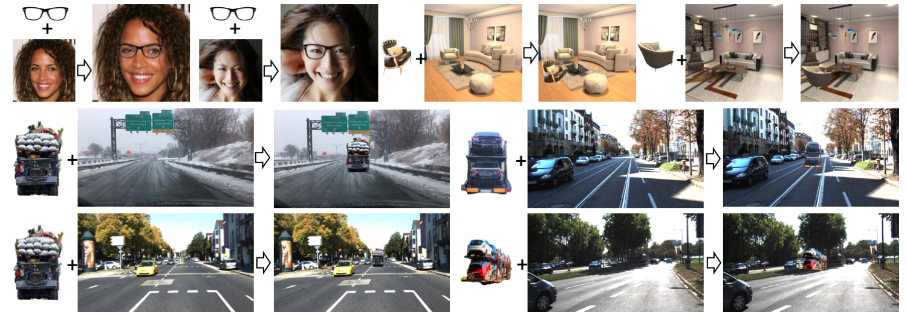

# SAC-GAN

PyTorch implementation for paper "[SAC-GAN: Structure-Aware Image Composition](https://arxiv.org/abs/2112.06596)", Hang Zhou, [Rui Ma](https://ruim-jlu.github.io/), [Lingxiao Zhang](https://scholar.google.com/citations?user=Feu8yU0AAAAJ&hl=en), [Lin Gao](http://geometrylearning.com/lin/), [Ali Mahdavi-Amiri](https://www.sfu.ca/~amahdavi/Home.html), [Hao (Richard) Zhang](https://www.cs.sfu.ca/~haoz/).



Dependencies
--
Our code has been tested with Python 3.6, Pytorch 1.6.0, CUDA 10.1 and cuDNN 7.0 on Ubuntu 18.04.

Install required dependencies, run
```
conda env create -f environment.yml
```

Datasets and Pre-trained weights
--
Our network is trained individually on Cityscapes (for vehicle/pedestrian/street light&sign composition), 3D-FUTURE & 3D-FRONT rendered images (for chair composition), and CelebAHQ (for glasses composition). 


Usage
--

Train SAC-GAN on Cityscapes: 
```
python main.py \
       --phase train \
       --dataset_name 'cityscapes' \
       --dataset YOUR_DATA_DIR \
       --result_dir YOUR_RESULTS_DIR \
       --epoch 10 \
       --class_num 19 \
       --layout_flag True \
       --save_freq 500  \
       --rec_weight 100 \
       --latent_rec_weight 0.05 \
       --affine_weight 1 \
       --layout_weight 1
```

Test
```
python main.py \
       --phase test \
       --dataset_name 'cityscapes' \
       --dataset YOUR_DATA_DIR \
       --result_dir YOUR_RESULTS_DIR \
       --class_num 19 \
       --layout_flag False
```

License
--
This project is licensed under the terms of the MIT license. 
